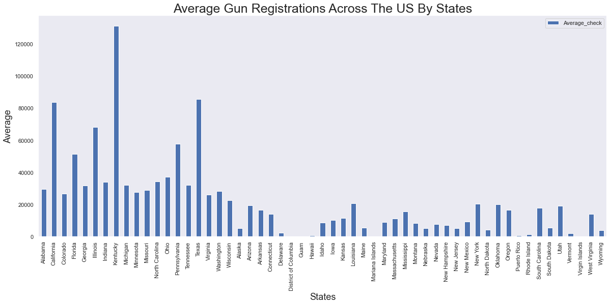

# FBI Gun Data Analysis
# By (Okolo Uchenna)

## Dataset
This a 19 year period data set from the FBI's National Instant Criminal Background Check System (NICS) spanning from 1998 to 2017. The NICS system is used to determine the eligibility of a person to purchase firearms in the US based on their criminal records. Basic data cleaning is carried out on the dataset.

## Summary
<ul>
    <li>kentucky has the busiest gun sales in the country while Mariana Islands records the least of this activity.</li>
    <li>There are nineteen states with states average sales above national average for total gun background checks and they make up 73 percent of total gun purchaces in the US.</li>
    <li>The overall trend of gun purchase in the US has continuously increased within the timeframe provided in the data.</li>
    <li>handguns and long-guns make up the majority of gun sales.</li>
</ul>

